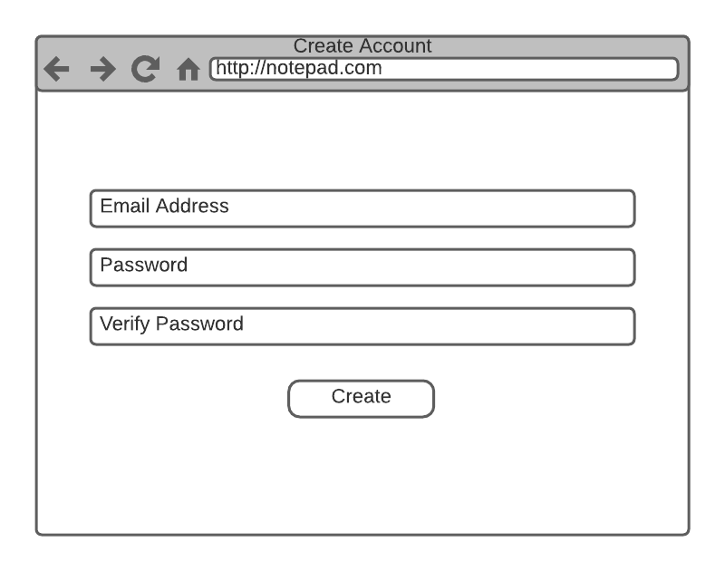
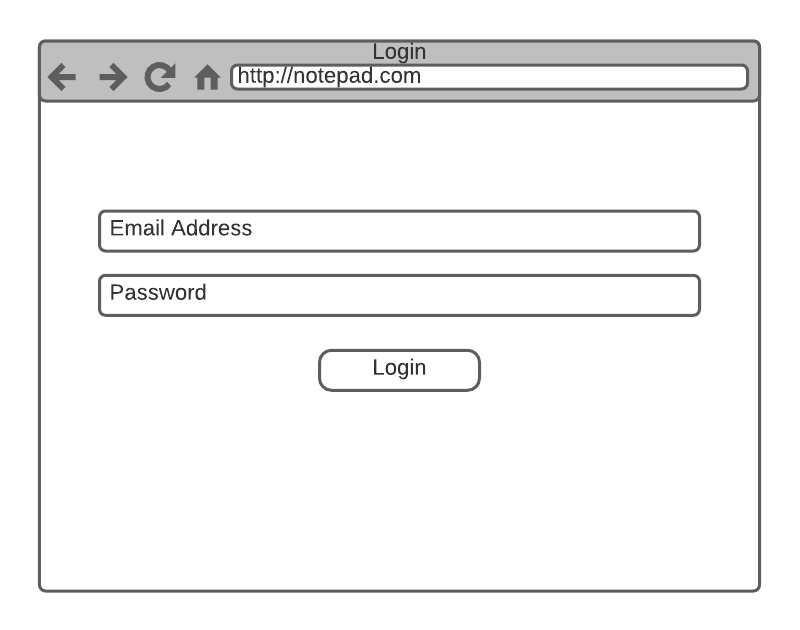
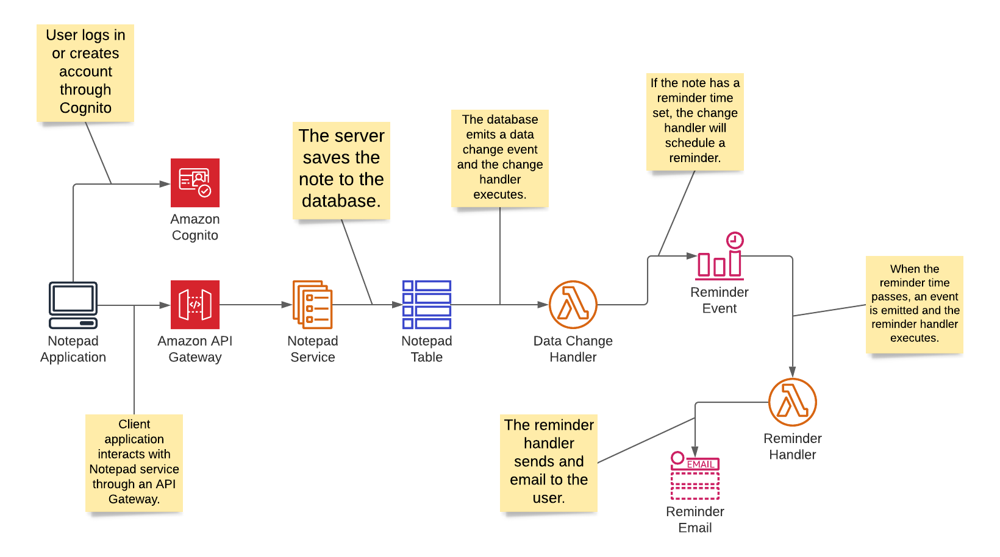

# Unison Senior Cloud Systems Engineer Mini-Project
For this mini-project you will create system documentation for a fictional application. The document could include
information for the environment in AWS where the application will run, what to consider for securing the application,
and also what we might want to monitor. The engineers will take of the basic infrastructure but will need an environment
to run in.

_**Feel free to fork this repository and send us the Github link when you are finished. Be prepared to present your
documentation and recommendations to a small team.**_

## The Application
The application is simple notepad application that allows users to create an account, make notes, and also setup
reminders associated with a note. Hosted in AWS, this application makes use of Cognito, API Gateway, ECS,
DynamoDB, Lambda, CloudWatch events, and SES. The engineers have architected the main parts of the system but require
further help with an AWS environment where they can deploy their system. Our compliance department also would like to
know how we can best secure this application to reduce our vulnerabilities to cyber-attacks and data breaches. The VP
of Engineering would also like to be able to track application performance and be alerted when things break. 

### The User Interface
The application allows people to creat and account or login if they already have an account.





Once the user has logged in they are able to create and search notes as well as adjust reminders.


### The Application Architecture
The application architecture consists of the following design. The engineers have determined this to be the best
solution given the requirements.



### The Notepad API
The Notepad API contains full CRUD operations. The service will run on ECS in a container and is exposed to the Internet
through an API Gateway. The following table described the endpoints available:

|HTTP Method|Path|Description|
|-----------|----|-----------|
|GET|/notes|This will retrieve notes from the server. A `query` query string variable can be set to filter the notes.|
|GET|/notes/{id}|This will retrieve a note with the given ID.|
|POST|/notes|This will create a new note from the JSON value in the payload.|
|PUT|/notes/{id}|This will update the note with the given ID using the JSON value in the payload.|
|DELETE|/notes/{id}|This will delete the note with the given ID.|

The Note data is passed as a JSON document. The structure looks like this:
```json
{
  "id": "The ID of the note",
  "title": "The title or text of the note.",
  "schedule": "An optional date and time formatted as an ISO-8601 string."
}
```
Here is an example note:
```json
{
  "id": "c8095d4b-991e-42b7-82f7-298f73950808",
  "title": "Remember to celebrate",
  "schedule": "2022-01-01T00:00:00.000-07:00"
}
```

# The Project

What we would like are the following items created by you:

* Documentation about how an environment might look for running this application in AWS. It is up to you 
  as to how much information you think should be included and the extent of the plan.
    
* Documentation about how we can secure this application to reduce the possibility of cyber-attacks and data breaches.
  
* Documentation for monitoring and alerting when there are issues as well as collecting and reporting on performance
  metrics. 
  
* Any other documentation that you deem appropriate.
  
You can create markdown inside a forked repository or create other documentation and store it in the "docs" directory.
Feel free to use Google docs and link to those or send the link to that documentation if you are not forking this repo.
We will assess your written communication skills from the documents you create and your verbal communication skills
during the presentation.

If you have any questions then please reach out to our HR representative.
